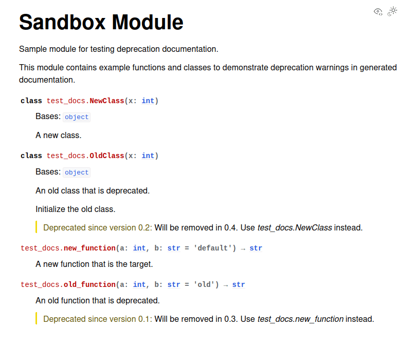

# pyDeprecate

**Simple tooling for marking deprecated functions or classes and re-routing to their successors.**

> **Summary**: pyDeprecate is a lightweight Python library for managing function and class deprecations with zero dependencies. It provides automatic call forwarding to replacement functions, argument mapping between old and new APIs, and configurable warning controls to prevent log spam. Perfect for library maintainers evolving APIs while maintaining backward compatibility.

[](https://pypi.org/project/pyDeprecate/)
[](https://github.com/Borda/pyDeprecate/blob/main/LICENSE)
[](https://app.fossa.com/projects/git%2Bgithub.com%2FBorda%2FpyDeprecate?ref=badge_shield&issueType=license)

[](https://badge.fury.io/py/pyDeprecate)
[](https://pepy.tech/project/pyDeprecate)
[](https://anaconda.org/conda-forge/pyDeprecate)

[](https://www.codefactor.io/repository/github/borda/pydeprecate)

[](https://github.com/Borda/pyDeprecate/actions/workflows/ci_testing.yml)
[](https://github.com/Borda/pyDeprecate/actions/workflows/code-format.yml)
[](https://codecov.io/gh/Borda/pyDeprecate)
[](https://results.pre-commit.ci/latest/github/Borda/pyDeprecate/main)

______________________________________________________________________

## 📋 Table of Contents

- [📖 Overview](#overview)
- [✨ Features](#features)
- [💾 Installation](#installation)
- [🚀 Quick Start](#quick-start)
- [📚 Use-cases and Applications](#use-cases-and-applications)
  - [Simple function forwarding](#simple-function-forwarding)
  - [Advanced target argument mapping](#advanced-target-argument-mapping)
  - [Deprecation warning only](#deprecation-warning-only)
  - [Self argument mapping](#self-argument-mapping)
  - [Multiple deprecation levels](#multiple-deprecation-levels)
  - [Conditional skip](#conditional-skip)
  - [Class deprecation](#class-deprecation)
  - [Automatic docstring updates](#automatic-docstring-updates)
- [🔇 Understanding the void() Helper](#understanding-the-void-helper)
- [🔍 Validating Wrapper Configuration](#validating-wrapper-configuration)
- [🧪 Testing Deprecated Code](#testing-deprecated-code)
- [🔧 Troubleshooting](#troubleshooting)
- [🤝 Contributing](#contributing)

## 📖 Overview

The common use-case is moving your functions across a codebase or outsourcing some functionalities to new packages.
For most of these cases, you want to maintain some compatibility, so you cannot simply remove the past function. You also want to warn users for some time that the functionality they have been using has moved and is now deprecated in favor of another function (which should be used instead) and will soon be removed completely.

Another good aspect is not overwhelming users with too many warnings, so per function/class, this warning is raised only N times in the preferred stream (warning, logger, etc.).

## ✨ Features

- ⚠️ Deprecation warnings are shown once per function by default (prevents log spam)
- 🔄 Arguments are automatically mapped to the target function
- 🚫 The deprecated function body is never executed when using `target`
- ⚡ Minimal runtime overhead with zero dependencies (Python standard library only)
- 🛠️ Supports deprecating functions, methods, and classes
- 📝 Optionally, docstrings can be updated automatically to reflect deprecation
- 🔍 Preserves original function signature, annotations and metadata for introspection
- ⚙️ Configurable warning message template and output stream (logging, warnings, custom callable)
- 🎯 Fine‑grained control: per‑argument deprecation/mapping and conditional `skip_if` behavior
- 🧪 Includes testing helpers (e.g., `no_warning_call`) for deterministic tests
- 🔗 Compatible with methods, class constructors and cross‑module moves

## 💾 Installation

Simple installation from PyPI:

```bash
pip install pyDeprecate
```

<details>
  <summary>Other installations</summary>

Simply install with pip from source:

```bash
pip install https://github.com/Borda/pyDeprecate/archive/main.zip
```

</details>

## 🚀 Quick Start

Here's the simplest way to get started with deprecating a function:

```python
from deprecate import deprecated


# Your new function
def new_sum(a: int = 0, b: int = 3) -> int:
    return a + b


# Mark the old one as deprecated and forward calls automatically
@deprecated(target=new_sum, deprecated_in="1.0", remove_in="2.0")
def old_sum(a: int, b: int = 5) -> int:
    pass  # Implementation not needed - calls are forwarded to new_sum


# Using the old function works but shows a warning
result = old_sum(1, 2)  # Returns 3
# Warning: The `old_sum` was deprecated since v1.0 in favor of `__main__.new_sum`.
#          It will be removed in v2.0.
```

That's it! All calls to `old_sum()` are automatically forwarded to `new_sum()` with a deprecation warning.

## 📚 Use-cases and Applications

The functionality is kept simple and all defaults should be reasonable, but you can still do extra customization such as:

- 💬 define user warning message and preferred stream
- 🔀 extended argument mapping to target function/method
- 🎯 define deprecation logic for self arguments
- 📊 specify warning count per:
  - called function (for func deprecation)
  - used arguments (for argument deprecation)
- ⚙️ define conditional skip (e.g. depending on some package version)

In particular the target values (cases):

- _None_ - raise only warning message (ignore all argument mapping)
- _True_ - deprecate some argument of itself (argument mapping should be specified)
- _Callable_ - forward call to new methods (optionally also argument mapping or extras)

### ➡️ Simple function forwarding

It is very straightforward: you forward your function call to a new function and all arguments are mapped:

```python
def base_sum(a: int = 0, b: int = 3) -> int:
    """My new function anywhere in the codebase or even other package."""
    return a + b


# ---------------------------

from deprecate import deprecated


@deprecated(target=base_sum, deprecated_in="0.1", remove_in="0.5")
def depr_sum(a: int, b: int = 5) -> int:
    """
    My deprecated function which now has an empty body
     as all calls are routed to the new function.
    """
    pass  # or you can just place docstring as one above


# calling this function will raise a deprecation warning:
#   The `depr_sum` was deprecated since v0.1 in favor of `__main__.base_sum`.
#   It will be removed in v0.5.
print(depr_sum(1, 2))
```

<details>
  <summary>sample output:</summary>

```
3
```

</details>

### 🔀 Advanced target argument mapping

Another more complex example is using argument mapping is:

<details>
  <summary>Advanced example</summary>

```python
import logging
from sklearn.metrics import accuracy_score
from deprecate import deprecated, void


@deprecated(
    # use standard sklearn accuracy implementation
    target=accuracy_score,
    # custom warning stream
    stream=logging.warning,
    # number of warnings per lifetime (with -1 for always)
    num_warns=5,
    # custom message template
    template_mgs="`%(source_name)s` was deprecated, use `%(target_path)s`",
    # as target args are different, define mapping from source to target func
    args_mapping={"preds": "y_pred", "target": "y_true", "blabla": None},
)
def depr_accuracy(preds: list, target: list, blabla: float) -> float:
    """My deprecated function which is mapping to sklearn accuracy."""
    # to stop complain your IDE about unused argument you can use void/empty function
    return void(preds, target, blabla)


# calling this function will raise a deprecation warning:
#   WARNING:root:`depr_accuracy` was deprecated, use `sklearn.metrics.accuracy_score`
print(depr_accuracy([1, 0, 1, 2], [0, 1, 1, 2], 1.23))
```

sample output:

```
0.5
```

</details>

### ⚠️ Deprecation warning only

Base use-case with no forwarding and just raising a warning:

```python
from deprecate import deprecated


@deprecated(target=None, deprecated_in="0.1", remove_in="0.5")
def my_sum(a: int, b: int = 5) -> int:
    """My deprecated function which still has to have implementation."""
    return a + b


# calling this function will raise a deprecation warning:
#   The `my_sum` was deprecated since v0.1. It will be removed in v0.5.
print(my_sum(1, 2))
```

<details>
  <summary>sample output:</summary>

```
3
```

</details>

**Note:** When using `target=None`, the deprecated function's implementation must be preserved and will be executed. The deprecation decorator only adds a warning without forwarding.

### 🔄 Self argument mapping

We also support deprecation and argument mapping for the function itself:

```python
from deprecate import deprecated


@deprecated(
    # define as deprecation some self argument - mapping
    target=True,
    args_mapping={"coef": "new_coef"},
    # common version info
    deprecated_in="0.2",
    remove_in="0.4",
)
def any_pow(base: float, coef: float = 0, new_coef: float = 0) -> float:
    """My function with deprecated argument `coef` mapped to `new_coef`."""
    return base**new_coef


# calling this function will raise a deprecation warning:
#   The `any_pow` uses deprecated arguments: `coef` -> `new_coef`.
#   They were deprecated since v0.2 and will be removed in v0.4.
print(any_pow(2, 3))
```

<details>
  <summary>code output:</summary>

```
8
```

</details>

### 🔗 Multiple deprecation levels

Eventually you can set multiple deprecation levels via chaining deprecation arguments as each could be deprecated in another version:

<details>
  <summary>Multiple deprecation levels</summary>

```python
from deprecate import deprecated


@deprecated(
    True,
    deprecated_in="0.3",
    remove_in="0.6",
    args_mapping=dict(c1="nc1"),
    template_mgs="Depr: v%(deprecated_in)s rm v%(remove_in)s for args: %(argument_map)s.",
)
@deprecated(
    True,
    deprecated_in="0.4",
    remove_in="0.7",
    args_mapping=dict(nc1="nc2"),
    template_mgs="Depr: v%(deprecated_in)s rm v%(remove_in)s for args: %(argument_map)s.",
)
def any_pow(base, c1: float = 0, nc1: float = 0, nc2: float = 2) -> float:
    return base**nc2


# calling this function will raise deprecation warnings:
#   FutureWarning('Depr: v0.3 rm v0.6 for args: `c1` -> `nc1`.')
#   FutureWarning('Depr: v0.4 rm v0.7 for args: `nc1` -> `nc2`.')
print(any_pow(2, 3))
```

code output:

```
8
```

</details>

### ⚙️ Conditional skip

Conditional skip of which can be used for mapping between different target functions depending on additional input such as package version

<details>
<summary>Code example</summary>

```python
from deprecate import deprecated

FAKE_VERSION = 1


def version_greater_1():
    return FAKE_VERSION > 1


@deprecated(True, "0.3", "0.6", args_mapping=dict(c1="nc1"), skip_if=version_greater_1)
def skip_pow(base, c1: float = 1, nc1: float = 1) -> float:
    return base ** (c1 - nc1)


# calling this function will raise a deprecation warning
print(skip_pow(2, 3))

# change the fake versions
FAKE_VERSION = 2

# will not raise any warning
print(skip_pow(2, 3))
```

</details>

<details>
  <summary>code output:</summary>

```
0.25
4
```

</details>

This can be beneficial with multiple deprecation levels shown above...

### 🏗️ Class deprecation

This case can be quite complex as you may deprecate just some methods, here we show full class deprecation:

<details>
<summary>Code example</summary>

```python
class NewCls:
    """My new class anywhere in the codebase or other package."""

    def __init__(self, c: float, d: str = "abc"):
        self.my_c = c
        self.my_d = d


# ---------------------------

from deprecate import deprecated, void


class PastCls(NewCls):
    """
    The deprecated class should be inherited from the successor class
     to hold all methods and properties.
    """

    @deprecated(target=NewCls, deprecated_in="0.2", remove_in="0.4")
    def __init__(self, c: int, d: str = "efg"):
        """
        You place the decorator around __init__ as you want
         to warn user just at the time of creating object.
        """
        void(c, d)


# calling this function will raise a deprecation warning:
#   The `PastCls` was deprecated since v0.2 in favor of `__main__.NewCls`.
#   It will be removed in v0.4.
inst = PastCls(7)
print(inst.my_c)  # returns: 7
print(inst.my_d)  # returns: "efg"
```

</details>

<details>
  <summary>code output:</summary>

```
7
efg
```

</details>

### 📝 Automatic docstring updates

You can automatically append deprecation information to your function's docstring:

<details>
<summary>Code example</summary>

```python
def new_function(x: int) -> int:
    """New implementation of the function."""
    return x * 2


# ---------------------------

from deprecate import deprecated


@deprecated(
    target=new_function,
    deprecated_in="1.0",
    remove_in="2.0",
    update_docstring=True,  # Enable automatic docstring updates
)
def old_function(x: int) -> int:
    """Old implementation that will be removed.

    Args:
        x: Input value

    Returns:
        Result of computation
    """
    pass


# The docstring now includes deprecation information
print(old_function.__doc__)
# Output includes:
# .. deprecated:: 1.0
#    Will be removed in 2.0.
#    Use `__main__.new_function` instead.
```

</details>

This is particularly useful for generating API documentation with tools like Sphinx, where the deprecation notice will appear in the generated docs.



## 🔇 Understanding the `void()` Helper

When using `@deprecated` with a `target` function, the deprecated function's body is never executed—all calls are automatically forwarded. However, your IDE might complain about "unused parameters". The `void()` helper function silences these warnings:

```python
def new_add(a: int, b: int) -> int:
    return a + b


# ---------------------------

from deprecate import deprecated, void


@deprecated(target=new_add, deprecated_in="1.0", remove_in="2.0")
def old_add(a: int, b: int) -> int:
    return void(a, b)  # Tells IDE: "Yes, I know these parameters aren't used"
    # This line is never reached - call is forwarded to new_add


# Alternative: You can also use pass or just a docstring
@deprecated(target=new_add, deprecated_in="1.0", remove_in="2.0")
def old_add_v2(a: int, b: int) -> int:
    """Just a docstring works too."""
    pass  # This also works
```

**💡 Note:** `void()` is purely for IDE convenience and has no runtime effect. It simply returns `None` after accepting any arguments.

## 🔍 Validating Wrapper Configuration

During development, you may want to verify that your deprecated wrappers are configured correctly. pyDeprecate provides two utilities for this:

The `DeprecatedCallableInfo` dataclass contains:

- `module`: Module name where the function is defined (empty for direct validation)
- `function`: Function name
- `deprecated_info`: The `__deprecated__` attribute dict from the decorator
- `invalid_args`: List of args_mapping keys that don't exist in the function signature
- `empty_mapping`: True if args_mapping is None or empty (no argument remapping)
- `identity_mapping`: List of args where key equals value (e.g., `{'arg': 'arg'}` - no effect)
- `self_reference`: True if target points to the same function (self-reference)
- `no_effect`: True if wrapper has zero impact (self-reference, empty mapping, or all identity)

### Validating a Single Function

The `validate_deprecated_callable()` utility extracts the configuration from the function's `__deprecated__` attribute and returns a `DeprecatedCallableInfo` dataclass that helps you identify configurations that would make your deprecation wrapper have zero impact:

<details>
<summary>Code example</summary>

```python
from deprecate import validate_deprecated_callable, deprecated, DeprecatedCallableInfo


# Define your deprecated function
@deprecated(target=True, args_mapping={"old_arg": "new_arg"}, deprecated_in="1.0")
def my_func(old_arg: int = 0, new_arg: int = 0) -> int:
    return new_arg


# Validate the configuration - automatically extracts `args_mapping` and target from the decorator
result = validate_deprecated_callable(my_func)
# DeprecatedCallableInfo(
#   function='my_func',
#   invalid_args=[],
#   empty_mapping=False,
#   identity_mapping=[],
#   self_reference=False,
#   no_effect=False
# )


# Example: Function with invalid args_mapping
@deprecated(target=True, args_mapping={"nonexistent": "new_arg"}, deprecated_in="1.0")
def bad_func(real_arg: int = 0) -> int:
    return real_arg


result = validate_deprecated_callable(bad_func)
# result.invalid_args == ['nonexistent']
print(result)


# Example: Function with empty mapping (no effect)
@deprecated(target=True, args_mapping={}, deprecated_in="1.0")
def empty_func(arg: int = 0) -> int:
    return arg


result = validate_deprecated_callable(empty_func)
# result.empty_mapping == True, result.no_effect == True
print(result)

# Quick check if wrapper has any effect
if result.no_effect:
    print("Warning: This wrapper configuration has zero impact!")
```

</details>

### Scanning a Package for Deprecated Wrappers

The `find_deprecated_callables()` utility scans an entire package or module and returns a list of `DeprecatedCallableInfo` dataclasses:

<details>
<summary>Code example</summary>

```python
from deprecate import find_deprecated_callables, DeprecatedCallableInfo

# For testing purposes, we use the test module; normally you would import your own package
from tests import collection_deprecate as my_package

# Scan an entire package for deprecated wrappers
results = find_deprecated_callables(my_package)

# Or scan using a string module path
results = find_deprecated_callables("tests.collection_deprecate")

# Check results - each item is a DeprecatedCallableInfo dataclass
for r in results:
    print(f"{r.module}.{r.function}: no_effect={r.no_effect}")
    if r.no_effect:
        print(f"  Warning: This wrapper has zero impact!")
        print(
            f"  invalid_args: {r.invalid_args}, identity_mapping: {r.identity_mapping}"
        )

# Filter to only ineffective wrappers
ineffective = [r for r in results if r.no_effect]
if ineffective:
    print(f"Found {len(ineffective)} deprecated wrappers with zero impact!")
```

</details>

### Generating Reports by Issue Type

Group validation results by issue type for better reporting:

<details>
<summary>Code example</summary>

```python
from deprecate import find_deprecated_callables

# For testing purposes, we use the test module; normally you would import your own package
from tests import collection_deprecate as my_package

results = find_deprecated_callables(my_package)

# Group by issue type (using dataclass attribute access)
wrong_args = [r for r in results if r.invalid_args]
identity_mappings = [r for r in results if r.identity_mapping]
self_refs = [r for r in results if r.self_reference]

print(f"=== Deprecation Validation Report ===")
print(f"Wrong arguments: {len(wrong_args)}")
print(f"Identity mappings: {len(identity_mappings)}")
print(f"Self-references: {len(self_refs)}")
```

</details>

### CI/pytest Integration

Use in pytest to validate your package's deprecation wrappers:

<details>
<summary>Code example</summary>

```python
import pytest
from deprecate import find_deprecated_callables

# For testing purposes, we use the test module; normally you would import your own package
from tests import collection_deprecate as my_package


def test_deprecated_wrappers_are_valid():
    """Validate all deprecated wrappers have proper configuration."""
    results = find_deprecated_callables(my_package)

    # Collect issues - errors for wrong args, warnings for identity mappings
    wrong_args = [r for r in results if r.invalid_args]
    identity_mappings = [r for r in results if r.identity_mapping]

    # Raise errors for wrong arguments (critical issues)
    if wrong_args:
        for r in wrong_args:
            print(f"ERROR: {r.module}.{r.function} has invalid args: {r.invalid_args}")
        pytest.fail(
            f"Found {len(wrong_args)} deprecated wrappers with invalid arguments"
        )

    # Warn for identity mappings (less severe)
    for r in identity_mappings:
        pytest.warns(UserWarning, match=f"{r.function} has identity mapping")
```

</details>

## 🧪 Testing Deprecated Code

pyDeprecate provides utilities to help you test deprecated code properly:

```python
from deprecate import deprecated
from deprecate.utils import no_warning_call, void
import pytest


def new_func(x: int) -> int:
    return x * 2


@deprecated(target=new_func, deprecated_in="1.0", remove_in="2.0")
def old_func(x: int) -> int:
    pass


@deprecated(target=new_func, deprecated_in="1.0", remove_in="2.0")
def old_func2(x: int) -> int:
    return void(x)


def test_deprecated_function_shows_warning():
    """Verify the deprecation warning is shown."""
    with pytest.warns(FutureWarning, match="old_func.*deprecated"):
        result = old_func(42)
    assert result == 84


def test_new_function_no_warning():
    """Verify new function doesn't trigger warnings."""
    with no_warning_call(FutureWarning):
        result = new_func(42)
    assert result == 84


def test_no_warning_after_first_call():
    """By default, warnings are shown only once per function."""
    # First call shows warning
    with pytest.warns(FutureWarning):
        old_func2(1)

    # Subsequent calls don't show warning (by default num_warns=1)
    with no_warning_call(FutureWarning):
        old_func2(2)


# call the tests for CI demonstration/validation
test_deprecated_function_shows_warning()
test_new_function_no_warning()
test_no_warning_after_first_call()
```

<details>
<summary>Advanced: Control warning frequency</summary>

```python
# Minimal replacement implementation used in examples
def new_func(x: int) -> int:
    return x * 2


# ---------------------------

from deprecate import deprecated


# Show warning every time (useful for critical deprecations)
@deprecated(target=new_func, deprecated_in="1.0", remove_in="2.0", num_warns=-1)
def old_func_always_warn(x: int) -> int:
    pass


# Show warning N times total
@deprecated(target=new_func, deprecated_in="1.0", remove_in="2.0", num_warns=5)
def old_func_warn_n_times(x: int) -> int:
    pass
```

</details>

## 🔧 Troubleshooting

### ❗ TypeError: `Failed mapping`

**Problem:** `TypeError: Failed mapping of 'my_func', arguments missing in target source: ['old_arg']`

**Cause:** Your deprecated function has arguments that the target function doesn't accept.

<details>
<summary>Solutions</summary>

1. **Skip the argument** (if it's no longer needed):

   ```python
   # define a target that ignores the extra arg
   def new_func(required_arg: int, **kwargs) -> int:
       return required_arg * 2


   # ---------------------------

   from deprecate import deprecated


   # None means skip this argument
   @deprecated(target=new_func, args_mapping={"old_arg": None})
   def old_func(old_arg: int, new_arg: int) -> int:
       pass
   ```

2. **Rename the argument** (if target uses different name):

   ```python
   def new_func(new_name: int) -> int:
       return new_name * 2


   # ---------------------------

   from deprecate import deprecated


   # Map old to new
   @deprecated(target=new_func, args_mapping={"old_name": "new_name"})
   def old_func(old_name: int) -> int:
       pass
   ```

3. **Use target=True for self-deprecation** (deprecate argument of same function):

   ```python
   from deprecate import deprecated


   # Deprecate within same function
   @deprecated(target=True, args_mapping={"old_arg": "new_arg"})
   def my_func(old_arg: int = 0, new_arg: int = 0) -> int:
       return new_arg * 2
   ```

</details>

### ❗ TypeError: `User function 'should_ship' shall return bool`

**Problem:** `TypeError: User function 'should_ship' shall return bool, but got: <type>`

**Cause:** When using `skip_if` with a callable, the function must return a boolean value.

<details>
<summary>Solution</summary>

```python
# Minimal replacement function for examples
def new_func() -> str:
    return "Hi!"


# ---------------------------

from deprecate import deprecated


# Correct: function returns bool
def should_skip() -> bool:
    return False  # replace with your condition


@deprecated(target=new_func, skip_if=should_skip)
def old_func1():
    pass


# Also correct: use a lambda
@deprecated(target=new_func, skip_if=lambda: False)
def old_func2():
    pass
```

</details>

### ⚠️ Warning Not Showing

**Problem:** You don't see the deprecation warning.

**Cause:** By default, warnings are shown **only once per function** (`num_warns=1`) to prevent log spam.
For per-argument deprecation (when using `args_mapping` with `target=True`), each deprecated argument
has its own warning counter, meaning warnings for different arguments are tracked independently.

<details>
<summary>Solutions</summary>

```python
# Minimal replacement function for examples
def new_func(x: int) -> int:
    return x * 2


# ---------------------------

from deprecate import deprecated


# Show warning every time
@deprecated(target=new_func, num_warns=-1)  # -1 means unlimited
def old_func_always_warn():
    pass


# Show warning N times total
@deprecated(target=new_func, num_warns=5)  # Show 5 times
def old_func_warn_n_times():
    pass
```

</details>

### 📦 Deprecation Not Working Across Modules

If you're moving functions to a different module or package, show the pattern rather than importing a non-existent package in the docs.

The warning will correctly show the full path for real imports when used in your package.

## 🤝 Contributing

Have you faced this issue in the past or are you facing it now? Do you have good ideas for improvement? All contributions are welcome!

Please read our [Contributing Guide](.github/CONTRIBUTING.md) for details on how to contribute, and our [Code of Conduct](.github/CODE_OF_CONDUCT.md) for community guidelines.
