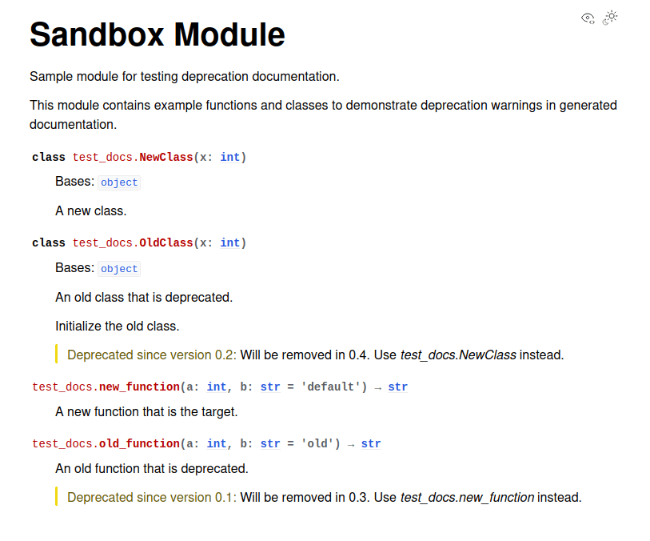

# pyDeprecate

**Simple tooling for marking deprecated functions or classes and re-routing to their successors.**

> **Summary**: pyDeprecate is a lightweight Python library for managing function and class deprecations with zero dependencies. It provides automatic call forwarding to replacement functions, argument mapping between old and new APIs, and configurable warning controls to prevent log spam. Perfect for library maintainers evolving APIs while maintaining backward compatibility.

[](https://pypi.org/project/pyDeprecate/)
[](https://github.com/Borda/pyDeprecate/blob/main/LICENSE)
[](https://app.fossa.com/projects/git%2Bgithub.com%2FBorda%2FpyDeprecate?ref=badge_shield&issueType=license)

[](https://badge.fury.io/py/pyDeprecate)
[](https://pepy.tech/project/pyDeprecate)
[](https://anaconda.org/conda-forge/pyDeprecate)

[](https://www.codefactor.io/repository/github/borda/pydeprecate)

[](https://github.com/Borda/pyDeprecate/actions/workflows/ci_testing.yml)
[](https://github.com/Borda/pyDeprecate/actions/workflows/ci_install-pkg.yml)
[](https://codecov.io/gh/Borda/pyDeprecate)
[](https://results.pre-commit.ci/latest/github/Borda/pyDeprecate/main)

______________________________________________________________________

## 📋 Table of Contents

- [📖 Overview](#-overview)
- [✨ Features](#-features)
  - [Comparison with Other Tools](#-comparison-with-other-tools)
- [💾 Installation](#-installation)
- [🚀 Quick Start](#-quick-start)
- [🗺 API at a Glance](#-api-at-a-glance)
- [📚 Use-cases and Applications](#-use-cases-and-applications)
  - [Simple function forwarding](#-simple-function-forwarding)
  - [Advanced target argument mapping](#-advanced-target-argument-mapping)
  - [Deprecation warning only](#-deprecation-warning-only)
  - [Self argument mapping](#-self-argument-mapping)
  - [Multiple deprecation levels](#-multiple-deprecation-levels)
  - [Conditional skip](#-conditional-skip)
  - [Class deprecation](#-class-deprecation)
  - [Deprecating constants and instances](#-deprecating-constants-and-instances)
  - [Deprecating Enums and dataclasses](#-deprecating-enums-and-dataclasses)
  - [Automatic docstring updates](#-automatic-docstring-updates)
  - [Injecting new required arguments](#-injecting-new-required-arguments)
- [🔇 Understanding the void() Helper](#-understanding-the-void-helper)
- [🔍 Audit](#-audit)
  - [Validating Wrapper Configuration](#-validating-wrapper-configuration)
  - [Enforcing Deprecation Removal Deadlines](#-enforcing-deprecation-removal-deadlines)
  - [Detecting Deprecation Chains](#-detecting-deprecation-chains)
- [🧪 Testing Deprecated Code](#-testing-deprecated-code)
- [🔧 Troubleshooting](#-troubleshooting)
- [🤝 Contributing](#-contributing)

## 📖 Overview

The common use-case is moving your functions across a codebase or outsourcing some functionalities to new packages.
For most of these cases, you want to maintain some compatibility, so you cannot simply remove the past function. You also want to warn users for some time that the functionality they have been using has moved and is now deprecated in favor of another function (which should be used instead) and will soon be removed completely.

Another good aspect is not overwhelming users with too many warnings, so per function/class, this warning is raised only N times in the preferred stream (warning, logger, etc.).

## ✨ Features

- ⚠️ Deprecation warnings are shown once per function by default (prevents log spam)
- 🔄 Arguments are automatically mapped to the target function
- 🚫 The deprecated function body is never executed when using `target`
- ⚡ Minimal runtime overhead with zero dependencies (Python standard library only)
- 🛠️ Supports deprecating functions, methods, and classes
- 📝 Optionally, docstrings can be updated automatically to reflect deprecation
- 🔍 Preserves original function signature, annotations and metadata for introspection
- ⚙️ Configurable warning message template and output stream (logging, warnings, custom callable)
- 🎯 Fine‑grained control: per‑argument deprecation/mapping and conditional `skip_if` behavior
- 🧪 Includes testing helpers (e.g., `assert_no_warnings`, formerly `no_warning_call`) for deterministic tests
- 🔗 Compatible with methods, class constructors and cross‑module moves

### 📊 Comparison with Other Tools

> 💬 _How does pyDeprecate compare to other Python deprecation solutions?_

While `pyDeprecate` focuses on comprehensive forwarding and argument mapping, other tools might fit different needs:

- [`warnings.warn`](https://docs.python.org/3/library/warnings.html) (stdlib): The standard library's built-in function, perfect for simple cases requiring no dependencies.
- [`deprecation`](https://pypi.org/project/deprecation/) (Lib): A widely used library by Brian Curtin, excellent for version-based deprecations.
- [`Deprecated`](https://pypi.org/project/Deprecated/) (wrapt): A robust decorator-based library by Laurent Laporte with `wrapt` integration.

<details>
  <summary><strong>Key Advantages & Feature Breakdown</strong></summary>

- **Simple Warnings**: Emits standard Python warnings, compatible with default error handling tools.
- **Auto-Forward Calls**: Automatically redirects calls to the new function, ensuring the deprecated code is *never* executed.
- **Argument Mapping**: Seamlessly translates old API arguments to new ones, handling complex renames and restructuring.
- **Argument Deprecation**: Warns when specific arguments are used, even if the function itself isn't deprecated.
- **Docstring Updates**: Automatically appends deprecation notices to the function's docstring.
- **Version Tracking**: Clearly specifies `deprecated_in` and `remove_in` versions for better lifecycle management.
- **Prevent Log Spam**: Prevents log spam by showing warnings only once per function (or N times) by default.
- **Zero Extra Depend.**: Lightweight and easy to install, relying solely on the Python standard library.
- **Custom Streams**: Route warnings to `logging`, standard `warnings`, or any custom callable to fit your monitoring stack.
- **Testing Helpers**: Built-in tools like `assert_no_warnings()` ensure your deprecations are testable and deterministic.

</details>

| Feature                  | `pyDeprecate` | `warnings.warn` (stdlib) | `deprecation` (Lib) | `Deprecated` (wrapt) |
| ------------------------ | :-----------: | :----------------------: | :-----------------: | :------------------: |
| **Simple Warnings**      |      ✅       |            ✅            |         ✅          |          ✅          |
| **Auto-Forward Calls**   |      ✅       |            ❌            |         ❌          |          ❌          |
| **Argument Mapping**     |      ✅       |            ❌            |         ❌          |          ❌          |
| **Argument Deprecation** |      ✅       |            ✍️            |         ❌          |          ❌          |
| **Docstring Updates**    |      ✅       |            ❌            |         ✅          |          ✅          |
| **Version Tracking**     |      ✅       |            ✍️            |         ✅          |          ✅          |
| **Prevent Log Spam**     |      ✅       |            ✍️            |         ❌          |          ❌          |
| **Zero Extra Depend.**   |      ✅       |            ✅            |         ❌          |          ❌          |
| **Custom Streams**       |      ✅       |            ✅            |         ❌          |          ❌          |
| **Testing Helpers**      |      ✅       |            ❌            |         ❌          |          ❌          |

✍️ = possible but requires manual implementation

> [!NOTE]
> This comparison is compiled to the best of our knowledge and we're happy to make any justified corrections. If you spot an inaccuracy, please [open an issue](https://github.com/Borda/pyDeprecate/issues) or submit a PR.

## 💾 Installation

Requires **Python 3.9 or later**.

Simple installation from PyPI:

```bash
pip install pyDeprecate
```

<details>
  <summary>Other installations</summary>

Simply install with pip from source:

```bash
pip install https://github.com/Borda/pyDeprecate/archive/main.zip
```

</details>

## 🚀 Quick Start

Here's the simplest way to get started with deprecating a function:

```python
from deprecate import deprecated


# NEW/FUTURE API — renamed to be more explicit about what it computes
def compute_sum(a: int = 0, b: int = 3) -> int:
    return a + b


# DEPRECATED API — `addition` was the original name before the rename
@deprecated(target=compute_sum, deprecated_in="1.0", remove_in="2.0")
def addition(a: int, b: int = 5) -> int:
    pass  # body is not needed — calls are forwarded to compute_sum


# Using the original name still works but shows a warning
result = addition(1, 2)  # Returns 3
# Warning: The `addition` was deprecated since v1.0 in favor of `__main__.compute_sum`.
#          It will be removed in v2.0.
```

That's it! All calls to `addition()` are automatically forwarded to `compute_sum()` with a deprecation warning.

## 🗺 API at a Glance

Not sure which API to reach for? Start here.

**Pick the right decorator:**

| Scenario                                      | API to use                                              |
| --------------------------------------------- | ------------------------------------------------------- |
| Renaming a function or method                 | `@deprecated(target=new_func)`                          |
| Renaming an argument within the same function | `@deprecated(target=True, args_mapping={"old": "new"})` |
| Warn only — original body still runs          | `@deprecated(target=None)`                              |
| Deprecating a class, Enum, or dataclass name  | `@deprecated_class(target=NewClass)`                    |
| Deprecating a module-level constant or object | `deprecated_instance(obj, ...)`                         |

**All `@deprecated` parameters at a glance:**

| Param              | Default         | Purpose                                                                     |
| ------------------ | --------------- | --------------------------------------------------------------------------- |
| `target`           | —               | `Callable` to forward to · `True` to remap args in-place · `None` warn-only |
| `deprecated_in`    | `""`            | Version when deprecated (e.g. `"1.0"`)                                      |
| `remove_in`        | `""`            | Version when removed (e.g. `"2.0"`)                                         |
| `stream`           | `FutureWarning` | Warning sink; set to `None` to silence entirely                             |
| `num_warns`        | `1`             | `1` once · `-1` always · `N` exactly N times                                |
| `args_mapping`     | `None`          | `{"old": "new"}` rename · `{"old": None}` drop                              |
| `args_extra`       | `None`          | Fixed kwargs injected into the target call                                  |
| `skip_if`          | `False`         | `bool` or `Callable → bool`; skip deprecation when true                     |
| `update_docstring` | `False`         | Append Sphinx `.. deprecated::` notice to docstring                         |

> [!TIP]
> `@deprecated_class()` shares `target`, `deprecated_in`, `remove_in`, `num_warns`, `stream`, and `args_mapping`.
> `deprecated_instance()` shares all except `args_mapping`; it adds `name` (display name) and `read_only`.

## 📚 Use-cases and Applications

The functionality is kept simple and all defaults should be reasonable, but you can still do extra customization such as:

- 💬 define user warning message and preferred stream
- 🔀 extended argument mapping to target function/method
- 🎯 define deprecation logic for self arguments
- 📊 specify warning count per:
  - called function (for func deprecation)
  - used arguments (for argument deprecation)
- ⚙️ define conditional skip (e.g. depending on some package version)

In particular the target values (cases):

- _None_ - raise only warning message (ignore all argument mapping)
- _True_ - deprecate some argument of itself (argument mapping should be specified)
- _Callable_ - forward call to new methods (optionally also argument mapping or extras)

> [!NOTE]
> `@deprecated` is designed for functions and methods. To deprecate a class, Enum, or dataclass, use `@deprecated_class()` instead (see [Deprecating Enums and dataclasses](#-deprecating-enums-and-dataclasses)).

### ➡ Simple function forwarding

It is very straightforward: you forward your function call to a new function and all arguments are mapped:

```python
# NEW/FUTURE API — renamed to be more explicit about what it computes
def compute(a: int = 0, b: int = 3) -> int:
    """New function anywhere in the codebase or even other package."""
    return a + b


# ---------------------------

from deprecate import deprecated


# What this module looked like before the rename:
# def calculate(a: int, b: int = 5) -> int:
#     return a + b


# DEPRECATED API — `calculate` was the original name before the rename
@deprecated(target=compute, deprecated_in="0.1", remove_in="0.5")
def calculate(a: int, b: int = 5) -> int:
    """
    My deprecated function which now has an empty body
     as all calls are routed to the new function.
    """
    pass  # or you can just place docstring as one above


# calling this function will raise a deprecation warning:
#   The `calculate` was deprecated since v0.1 in favor of `__main__.compute`.
#   It will be removed in v0.5.
print(calculate(1, 2))
```

<details>
  <summary>Output: <code>print(calculate(1, 2))</code></summary>

```
3
```

</details>

<details>
<summary>Wrapper form: applying <code>@deprecated</code> without the decorator syntax</summary>

When the deprecated name already exists as a callable (for example, imported from another package), you can apply `deprecated()` directly without redefining the function:

```python
from deprecate import deprecated


# NEW/FUTURE API — in real usage this would be imported from another module
def compute_sum(a: int, b: int = 0) -> int:
    return a + b


# LEGACY — already-existing callable that is being deprecated
def addition(a: int, b: int = 0) -> int:
    return a + b


# DEPRECATED API — `calculate` was the original name in this package;
# wrap it without redefining a function body
calculate = deprecated(
    target=compute_sum,
    deprecated_in="0.5",
    remove_in="1.0",
)(addition)
```

This is an equivalent to the `@deprecated(...)` decorator form but applied to an already-existing callable — useful when the deprecated function lives in a dependency you don't control.

</details>

### 🔀 Advanced target argument mapping

Another more complex example is using argument mapping is:

<details>
  <summary>Example: mapping deprecated args to <code>sklearn.metrics.accuracy_score</code></summary>

```python
import logging
from sklearn.metrics import accuracy_score
from deprecate import deprecated, void


@deprecated(
    # use standard sklearn accuracy implementation
    target=accuracy_score,
    # custom warning stream
    stream=logging.warning,
    # number of warnings per lifetime (with -1 for always)
    num_warns=5,
    # custom message template
    template_mgs="`%(source_name)s` was deprecated, use `%(target_path)s`",
    # as target args are different, define mapping from source to target func
    args_mapping={"preds": "y_pred", "target": "y_true", "blabla": None},
)
def depr_accuracy(preds: list, target: list, blabla: float) -> float:
    """My deprecated function which is mapping to sklearn accuracy."""
    # to stop complain your IDE about unused argument you can use void/empty function
    return void(preds, target, blabla)


# calling this function will raise a deprecation warning:
#   WARNING:root:`depr_accuracy` was deprecated, use `sklearn.metrics.accuracy_score`
print(depr_accuracy([1, 0, 1, 2], [0, 1, 1, 2], 1.23))
```

sample output:

```
0.5
```

</details>

### ⚠ Deprecation warning only

Base use-case with no forwarding and just raising a warning:

```python
from deprecate import deprecated


@deprecated(target=None, deprecated_in="0.1", remove_in="0.5")
def my_sum(a: int, b: int = 5) -> int:
    """My deprecated function which still has to have implementation."""
    return a + b


# calling this function will raise a deprecation warning:
#   The `my_sum` was deprecated since v0.1. It will be removed in v0.5.
print(my_sum(1, 2))
```

<details>
  <summary>Output: <code>print(my_sum(1, 2))</code></summary>

```
3
```

</details>

> [!NOTE]
> When using `target=None`, the deprecated function's implementation must be preserved and will be executed. The deprecation decorator only adds a warning without forwarding.

### 🔄 Self argument mapping

We also support deprecation and argument mapping for the function itself:

```python
from deprecate import deprecated


@deprecated(
    # define as deprecation some self argument - mapping
    target=True,
    args_mapping={"coef": "new_coef"},
    # common version info
    deprecated_in="0.2",
    remove_in="0.4",
)
def any_pow(base: float, coef: float = 0, new_coef: float = 0) -> float:
    """My function with deprecated argument `coef` mapped to `new_coef`."""
    return base**new_coef


# calling this function will raise a deprecation warning:
#   The `any_pow` uses deprecated arguments: `coef` -> `new_coef`.
#   They were deprecated since v0.2 and will be removed in v0.4.
print(any_pow(2, 3))
```

<details>
  <summary>Output: <code>print(any_pow(2, 3))</code></summary>

```
8
```

</details>

### 🔗 Multiple deprecation levels

Eventually you can set multiple deprecation levels via chaining deprecation arguments as each could be deprecated in another version:

<details>
  <summary>Example: chaining two argument deprecations across different versions</summary>

```python
from deprecate import deprecated


@deprecated(
    True,
    deprecated_in="0.3",
    remove_in="0.6",
    args_mapping=dict(c1="nc1"),
    template_mgs="Depr: v%(deprecated_in)s rm v%(remove_in)s for args: %(argument_map)s.",
)
@deprecated(
    True,
    deprecated_in="0.4",
    remove_in="0.7",
    args_mapping=dict(nc1="nc2"),
    template_mgs="Depr: v%(deprecated_in)s rm v%(remove_in)s for args: %(argument_map)s.",
)
def any_pow(base, c1: float = 0, nc1: float = 0, nc2: float = 2) -> float:
    return base**nc2


# calling this function will raise deprecation warnings:
#   FutureWarning('Depr: v0.3 rm v0.6 for args: `c1` -> `nc1`.')
#   FutureWarning('Depr: v0.4 rm v0.7 for args: `nc1` -> `nc2`.')
print(any_pow(2, 3))
```

code output:

```
8
```

</details>

### ⚙ Conditional skip

Conditional skip of which can be used for mapping between different target functions depending on additional input such as package version

<details>
<summary>Example: <code>skip_if</code> based on a runtime condition</summary>

```python
from deprecate import deprecated

FAKE_VERSION = 1


def version_greater_1():
    return FAKE_VERSION > 1


@deprecated(True, "0.3", "0.6", args_mapping=dict(c1="nc1"), skip_if=version_greater_1)
def skip_pow(base, c1: float = 1, nc1: float = 1) -> float:
    return base ** (c1 - nc1)


# calling this function will raise a deprecation warning
print(skip_pow(2, 3))

# change the fake versions
FAKE_VERSION = 2

# will not raise any warning
print(skip_pow(2, 3))
```

</details>

<details>
  <summary>Output: <code>skip_pow</code> before and after version change</summary>

```
0.25
4
```

</details>

This can be beneficial with multiple deprecation levels shown above...

### 🏗 Class deprecation

Two common patterns: deprecating a single method (rename within the same class) or deprecating the whole class by forwarding `__init__` to a successor.

<details>
<summary>Example: renaming a method within the same class</summary>

```python
from deprecate import deprecated, void


class MyService:
    # NEW/FUTURE API — renamed from run() for clarity
    def execute(self, x: int) -> int:
        """Current method."""
        return x * 2

    # DEPRECATED API — `run` was the original name before the rename
    @deprecated(target=execute, deprecated_in="1.0", remove_in="2.0")
    def run(self, x: int) -> int:
        """Deprecated — renamed to execute()."""
        return void(x)


svc = MyService()
# calling this method will raise a deprecation warning:
#   The `run` was deprecated since v1.0 in favor of `__main__.execute`.
#   It will be removed in v2.0.
print(svc.run(5))
```

</details>

<details>
  <summary>Output: <code>svc.run(5)</code></summary>

```
10
```

</details>

<details>
<summary>Example: forwarding <code>__init__</code> to a successor class</summary>

```python
# NEW/FUTURE API — renamed to be more descriptive
class HttpClient:
    """My new class anywhere in the codebase or other package."""

    def __init__(self, c: float, d: str = "abc"):
        self.my_c = c
        self.my_d = d


# ---------------------------

from deprecate import deprecated, void


# DEPRECATED API — `Client` was the original name before it was renamed to HttpClient
class Client(HttpClient):
    """
    The deprecated class should be inherited from the successor class
     to hold all methods and properties.
    """

    @deprecated(target=HttpClient, deprecated_in="0.2", remove_in="0.4")
    def __init__(self, c: int, d: str = "efg"):
        """
        You place the decorator around __init__ as you want
         to warn user just at the time of creating object.

        Decorating __init__ warns at instantiation time and optionally
        forwards to another class. For deprecating the class itself
        (name change, Enum, dataclass), use @deprecated_class() instead.
        """
        void(c, d)


# calling this function will raise a deprecation warning:
#   The `Client` was deprecated since v0.2 in favor of `__main__.HttpClient`.
#   It will be removed in v0.4.
inst = Client(7)
print(inst.my_c)  # returns: 7
print(inst.my_d)  # returns: "efg"
```

</details>

<details>
  <summary>Output: <code>Client</code> instance attributes</summary>

```
7
efg
```

</details>

### 📦 Deprecating constants and instances

Use `deprecated_instance` to wrap objects accessed via attribute/item/call operations (for example, dicts,
lists, or custom objects) with transparent deprecation warnings. Primitive protocol methods (such as numeric
arithmetic on `float` or concatenation on `str`) are not proxied. For primitive constants like floats or
strings, prefer wrapping them in a container (such as a dict or configuration object) or updating call sites
directly, since arithmetic and other primitive protocol operations are not intercepted by the wrapper. The
`name` parameter is optional; when omitted it defaults to the type name of the wrapped object.

```python
from deprecate import deprecated_instance

# NEW/FUTURE API — renamed to be more explicit about its scope
TRAINING_CONFIG = {"lr": 0.001, "batch_size": 32, "epochs": 10}

# What it looked like before the rename:
# DEFAULTS = {"lr": 0.001, "batch_size": 32, "epochs": 10}

# DEPRECATED API — `DEFAULTS` was the original name; read-only so
# callers cannot mutate shared state through the deprecated alias
DEFAULTS = deprecated_instance(
    TRAINING_CONFIG,
    deprecated_in="1.2",
    remove_in="2.0",
    read_only=True,
)

# Reading still works but emits a FutureWarning once:
#   The `dict` was deprecated since v1.2. It will be removed in v2.0.
print(DEFAULTS["lr"])  # 0.001
```

<details>
  <summary>Output: <code>print(DEFAULTS["lr"])</code></summary>

```
0.001
```

</details>

### 🗂 Deprecating Enums and dataclasses

<details>
<summary>Example: <code>deprecated_class()</code> for Enum and dataclass</summary>

`deprecated_class()` wraps an entire Enum or dataclass in a transparent proxy that warns on every
access and forwards attribute, item, and call operations to the replacement class.
Use `args_mapping` to rename or drop kwargs when the deprecated class is called.

> [!NOTE]
> Type checks with `isinstance()` and `issubclass()` work transparently with `deprecated_class()` proxies and do not emit deprecation warnings, as these are structural checks rather than actual usage of the deprecated API.

```python
from enum import Enum
from dataclasses import dataclass
from deprecate import deprecated_class

# mypackage/theme.py — what it looked like before the rename:
#
# class Color(Enum):
#     RED = 1
#     BLUE = 2


# NEW/FUTURE API — renamed to be more descriptive
class ThemeColor(Enum):
    RED = 1
    BLUE = 2


# DEPRECATED API — `Color` was the original name; no class body needed,
# the proxy forwards all access to ThemeColor
Color = deprecated_class(target=ThemeColor, deprecated_in="1.0", remove_in="2.0")(ThemeColor)

# All access is forwarded to ThemeColor — a FutureWarning is emitted once:
#   The `Color` was deprecated since v1.0. It will be removed in v2.0.
print(Color.RED is ThemeColor.RED)  # True
print(Color(1) is ThemeColor.RED)  # True
print(Color["RED"] is ThemeColor.RED)  # True


# Precision migration story:
# - PointV1 used integer pixel coordinates.
# - PointV2 supports float coordinates for sub-pixel precision and smoother transforms.


# NEW/FUTURE API — extended to float precision
@dataclass
class PointV2:
    x: float
    y: float


# DEPRECATED API — PointV1 was the original integer-coordinate implementation
@deprecated_class(target=PointV2, deprecated_in="1.8", remove_in="2.0")
@dataclass
class PointV1:
    x: int
    y: int


# Existing callers using integer coordinates still work and are forwarded to PointV2:
p_old = PointV1(3, 4)
print(isinstance(p_old, PointV2))
print((p_old.x, p_old.y))

# New callers can use higher precision directly:
p_new = PointV2(3.25, 4.75)
print((p_new.x, p_new.y))
```

</details>

<details>
  <summary>Output: <code>Color</code> forwarding and <code>PointV1</code> precision migration</summary>

```
True
True
True
True
(3, 4)
(3.25, 4.75)
```

</details>

### 📝 Automatic docstring updates

You can automatically append deprecation information to your function's docstring:

<details>
<summary>Example: <code>update_docstring=True</code> appends a Sphinx deprecation notice</summary>

```python
# NEW/FUTURE API — renamed to be more explicit about what it does
def transform(x: int) -> int:
    """New implementation of the function."""
    return x * 2


# ---------------------------

from deprecate import deprecated


# DEPRECATED API — `process` was the original name before the rename
@deprecated(
    target=transform,
    deprecated_in="1.0",
    remove_in="2.0",
    update_docstring=True,  # Enable automatic docstring updates
)
def process(x: int) -> int:
    """Transforms the input value.

    Args:
        x: Input value

    Returns:
        Result of computation
    """
    pass


# The docstring now includes deprecation information
print(process.__doc__)
# Output includes:
# .. deprecated:: 1.0
#    Will be removed in 2.0.
#    Use `__main__.transform` instead.
```

</details>

This is particularly useful for generating API documentation with tools like Sphinx, where the deprecation notice will appear in the generated docs.



### ➕ Injecting new required arguments

When the target function gains a new parameter that callers of the old API never passed, use `args_extra` to inject a fixed value at the wrapper level:

```python
from deprecate import deprecated, void


# NEW/FUTURE API — `send_email` adds an explicit `priority` field
def send_email(to: str, subject: str, priority: str = "normal") -> str:
    return f"Sent to {to!r}: {subject!r} [{priority}]"


# DEPRECATED API — `notify` was the original name; it had no `priority` concept
@deprecated(
    target=send_email,
    deprecated_in="1.5",
    remove_in="2.0",
    # callers of `notify` never passed `priority`, so inject a sensible default
    args_extra={"priority": "normal"},
)
def notify(to: str, subject: str) -> str:
    """Deprecated — use send_email() with an explicit priority instead."""
    return void(to, subject)


# calling this function will raise a deprecation warning:
#   The `notify` was deprecated since v1.5 in favor of `__main__.send_email`.
#   It will be removed in v2.0.
print(notify("alice@example.com", "Hello"))
```

<details>
  <summary>Output: <code>notify("alice@example.com", "Hello")</code></summary>

```
Sent to 'alice@example.com': 'Hello' [normal]
```

</details>

> [!NOTE]
> `args_extra` only applies when `target` is a `Callable`. It is merged into the forwarded kwargs _after_ `args_mapping` is applied, so extra values can also override mapped ones.

## 🔇 Understanding the `void()` Helper

When using `@deprecated` with a `target` function, the deprecated function's body is never executed—all calls are automatically forwarded. However, your IDE might complain about "unused parameters". The `void()` helper function silences these warnings:

```python
def new_add(a: int, b: int) -> int:
    return a + b


# ---------------------------

from deprecate import deprecated, void


@deprecated(target=new_add, deprecated_in="1.0", remove_in="2.0")
def old_add(a: int, b: int) -> int:
    return void(a, b)  # Tells IDE: "Yes, I know these parameters aren't used"
    # This line is never reached - call is forwarded to new_add


# Alternative: You can also use pass or just a docstring
@deprecated(target=new_add, deprecated_in="1.0", remove_in="2.0")
def old_add_v2(a: int, b: int) -> int:
    """Just a docstring works too."""
    pass  # This also works
```

> [!TIP]
> `void()` is purely for IDE convenience and has no runtime effect. It simply returns `None` after accepting any arguments.

## 🔍 Audit

Deprecations are only as good as the hygiene around them. The `deprecate.audit` module provides utilities for verifying that deprecated wrappers are correctly configured, that removal deadlines are actually enforced, and that chains of deprecated-to-deprecated calls don't silently pile up. These tools are designed to run in CI pipelines and test suites, catching problems before they reach users.

> [!NOTE]
> **Renamed in v0.6**: `find_deprecated_callables` → `find_deprecation_wrappers`, `validate_deprecated_callable` → `validate_deprecation_wrapper`, `DeprecatedCallableInfo` → `DeprecationWrapperInfo`. The old names are still exported for backwards compatibility but will be removed in v1.0.

### Validating Wrapper Configuration

During development, you may want to verify that your deprecated wrappers are configured correctly. pyDeprecate provides two utilities for this: `validate_deprecation_wrapper()` for inspecting a single function, and `find_deprecation_wrappers()` for scanning an entire package.

The `DeprecationWrapperInfo` dataclass contains:

- `module`: Module name where the function is defined (empty for direct validation)
- `function`: Function name
- `deprecated_info`: The `__deprecated__` attribute dict from the decorator
- `invalid_args`: List of args_mapping keys that don't exist in the function signature
- `empty_mapping`: True if args_mapping is None or empty (no argument remapping)
- `identity_mapping`: List of args where key equals value (e.g., `{'arg': 'arg'}` - no effect)
- `self_reference`: True if target points to the same function (self-reference)
- `no_effect`: True if wrapper has zero impact (self-reference, empty mapping, or all identity)

<details>
<summary><b>Validating a Single Function</b></summary>

The `validate_deprecation_wrapper()` utility extracts the configuration from the function's `__deprecated__` attribute and returns a `DeprecationWrapperInfo` dataclass that helps you identify configurations that would make your deprecation wrapper have zero impact:

```python
from deprecate import validate_deprecation_wrapper, deprecated, DeprecationWrapperInfo


# Define your deprecated function
@deprecated(target=True, args_mapping={"old_arg": "new_arg"}, deprecated_in="1.0")
def my_func(old_arg: int = 0, new_arg: int = 0) -> int:
    return new_arg


# Validate the configuration - automatically extracts `args_mapping` and target from the decorator
result = validate_deprecation_wrapper(my_func)


# DeprecationWrapperInfo(
#   function='my_func',
#   invalid_args=[],
#   empty_mapping=False,
#   identity_mapping=[],
#   self_reference=False,
#   no_effect=False
# )


# Example: Function with invalid args_mapping
@deprecated(target=True, args_mapping={"nonexistent": "new_arg"}, deprecated_in="1.0")
def bad_func(real_arg: int = 0) -> int:
    return real_arg


result = validate_deprecation_wrapper(bad_func)
# result.invalid_args == ['nonexistent']
print(result)


# Example: Function with empty mapping (no effect)
@deprecated(target=True, args_mapping={}, deprecated_in="1.0")
def empty_func(arg: int = 0) -> int:
    return arg


result = validate_deprecation_wrapper(empty_func)
# result.empty_mapping == True, result.no_effect == True
print(result)

# Quick check if wrapper has any effect
if result.no_effect:
    print("Warning: This wrapper configuration has zero impact!")
```

</details>

<details>
<summary><b>Scanning a Package for Deprecated Wrappers</b></summary>

The `find_deprecation_wrappers()` utility scans an entire package or module and returns a list of `DeprecationWrapperInfo` dataclasses:

```python
from deprecate import find_deprecation_wrappers

# For testing purposes, we use the test module; normally you would import your own package
from tests import collection_deprecate as my_package

# Scan an entire package for deprecated wrappers
results = find_deprecation_wrappers(my_package)

# Or scan using a string module path
results = find_deprecation_wrappers("tests.collection_deprecate")

# Check results - each item is a DeprecationWrapperInfo dataclass
for r in results:
    print(f"{r.module}.{r.function}: no_effect={r.no_effect}")
    if r.no_effect:
        print(f"  Warning: This wrapper has zero impact!")
        print(f"  invalid_args: {r.invalid_args}, identity_mapping: {r.identity_mapping}")

# Filter to only ineffective wrappers
ineffective = [r for r in results if r.no_effect]
if ineffective:
    print(f"Found {len(ineffective)} deprecated wrappers with zero impact!")
```

</details>

<details>
<summary><b>Generating Reports by Issue Type</b></summary>

Group validation results by issue type for better reporting:

```python
from deprecate import find_deprecation_wrappers

# For testing purposes, we use the test module; normally you would import your own package
from tests import collection_deprecate as my_package

results = find_deprecation_wrappers(my_package)

# Group by issue type (using dataclass attribute access)
wrong_args = [r for r in results if r.invalid_args]
identity_mappings = [r for r in results if r.identity_mapping]
self_refs = [r for r in results if r.self_reference]

print(f"=== Deprecation Validation Report ===")
print(f"Wrong arguments: {len(wrong_args)}")
print(f"Identity mappings: {len(identity_mappings)}")
print(f"Self-references: {len(self_refs)}")
```

</details>

<details>
<summary><b>CI/pytest Integration</b></summary>

Use in pytest to validate your package's deprecation wrappers:

```python
import warnings

import pytest
from deprecate import find_deprecation_wrappers

# For testing purposes, we use the test module; normally you would import your own package
from tests import collection_deprecate as my_package


def test_deprecated_wrappers_are_valid():
    """Validate all deprecated wrappers have proper configuration."""
    results = find_deprecation_wrappers(my_package)

    # Collect issues — wrong arg names are errors, identity mappings are worth a warning
    wrong_args = [r for r in results if r.invalid_args]
    identity_mappings = [r for r in results if r.identity_mapping]

    # Raise errors for wrong arguments (critical issues)
    if wrong_args:
        for r in wrong_args:
            print(f"ERROR: {r.module}.{r.function} has invalid args: {r.invalid_args}")
        pytest.fail(f"Found {len(wrong_args)} deprecated wrappers with invalid arguments")

    # Warn for identity mappings (less severe)
    for r in identity_mappings:
        pytest.warns(UserWarning, match=f"{r.function} has identity mapping")
```

</details>

### ⏰ Enforcing Deprecation Removal Deadlines

When you deprecate code with a `remove_in` version, you're making a commitment to remove that code when that version is reached. However, it's easy to forget to actually remove the code—leading to "zombie code" that lingers past its scheduled removal.

pyDeprecate provides enforcement utilities to detect and prevent zombie code in your CI/CD pipeline:

The `validate_deprecation_expiry()` utility scans an entire module or package for expired deprecations:

<details>
<summary>Example: scanning a package for expired removal deadlines</summary>

```python
from deprecate import validate_deprecation_expiry

# For testing purposes, we use the test module; normally you would import your own package
from tests import collection_deprecate as my_package

# Scan your package for expired deprecations - using early-version that won't have expirations
expired = validate_deprecation_expiry(my_package, "0.2")
print(f"Found {len(expired)} expired")  # Returns a list of error messages (empty list = no expired)

# Example with expired deprecations found (using later-version)
expired = validate_deprecation_expiry(my_package, "0.5")
print(f"Found {len(expired)} expired")

# Auto-detect version from package metadata (mocked for demo)
from unittest.mock import patch

with patch("importlib.metadata.version", return_value="0.3"):
    expired = validate_deprecation_expiry(my_package)  # Automatically detects version
    print(f"Found {len(expired)} expired")

# Control recursion
expired = validate_deprecation_expiry(my_package, "0.1", recursive=False)  # Only scan top-level module
print(f"Found {len(expired)} expired")
```

</details>

<details>
  <summary>Output: expired count per scanned version</summary>

```
Found 14 expired
Found 28 expired
Found 17 expired
Found 0 expired
```

</details>

<details>
<summary><b>CI/pytest Integration for Expiry Enforcement</b></summary>

Integrate expiry checks into your test suite to catch zombie code automatically:

```python
import pytest
from deprecate import validate_deprecation_expiry

# For testing purposes, we use the test module; normally you would import your own package
from tests import collection_deprecate as my_package


def test_no_zombie_deprecations():
    """Ensure all deprecated code is removed when it reaches its deadline."""
    # Use your package's actual version - for this example we use a test version
    current_version = "0.5"  # Replace with: from mypackage import __version__

    expired = validate_deprecation_expiry(my_package, current_version)

    if expired:
        error_msg = "Found deprecated code past its removal deadline:\n"
        for msg in expired:
            error_msg += f"  - {msg}\n"
        pytest.fail(error_msg)


# Alternative: Use a fixture to run on every test session
# For testing purposes, we use the test module; normally you would import your own package
@pytest.fixture(scope="session", autouse=True)
def enforce_deprecation_deadlines():
    """Automatically check for zombie code before running any tests."""
    from tests import collection_deprecate as my_package

    current_version = "0.5"  # Replace with: from mypackage import __version__
    expired = validate_deprecation_expiry(my_package, current_version)
    if expired:
        raise AssertionError(
            f"Cannot run tests: {len(expired)} deprecated callables past removal deadline. "
            f"Remove these functions first: {expired}"
        )
```

</details>

> [!TIP]
>
> - Callables without `remove_in` are skipped (warnings-only deprecations are allowed)
> - Invalid version formats in `remove_in` are silently skipped
> - PEP 440 versioning is used for comparison (e.g., "2.0.0" > "1.9.5")
> - Pre-release versions are handled correctly (e.g., "1.5.0a1" < "1.5.0")

### 🔗 Detecting Deprecation Chains

When refactoring code, it's easy to create "lazy" deprecated wrappers that call other deprecated functions instead of calling the new target directly. This creates deprecation chains that defeat the purpose of deprecation.

The `validate_deprecation_chains()` utility scans a module or package for deprecated functions whose `target` is itself a deprecated callable. Such chains are wasteful: the outer wrapper should point directly to the final (non-deprecated) implementation. Detection is purely metadata-based — no source-code inspection.

<details>
<summary><b>Example: Detecting Both Chain Types</b></summary>

```python
from deprecate import deprecated, validate_deprecation_wrapper, void


def new_power(base: float, exponent: float = 2) -> float:
    return base**exponent


# deprecated forwarder — targets new_power directly
@deprecated(target=new_power, deprecated_in="1.0", remove_in="2.0")
def power_v2(base: float, exponent: float = 2) -> float:
    void(base, exponent)


# self-deprecation — renames old arg "exp" -> "exponent" within the same function
@deprecated(True, deprecated_in="1.0", remove_in="2.0", args_mapping={"exp": "exponent"})
def legacy_power(base: float, exp: float = 2, exponent: float = 2) -> float:
    return base**exponent


# BAD: targets power_v2 (another deprecated forwarder) — ChainType.TARGET
# SOLUTION: point directly to new_power
@deprecated(target=power_v2, deprecated_in="1.5", remove_in="2.5")
def caller_target_chain(base: float, exponent: float = 2) -> float:  # ❌
    return void(base, exponent)


# BAD: targets legacy_power (target=True with arg renaming) — ChainType.STACKED
# Mappings chain: "power" -> "exp" -> "exponent" — must be composed.
# SOLUTION: target=new_power, args_mapping={"power": "exponent"}
@deprecated(target=legacy_power, deprecated_in="1.5", remove_in="2.5", args_mapping={"power": "exp"})
def caller_stacked_chain(base: float, power: float = 2) -> float:  # ❌
    return void(base, power)


# GOOD: targets final implementation directly with composed mapping
@deprecated(target=new_power, deprecated_in="1.5", remove_in="2.5", args_mapping={"power": "exponent"})
def caller_direct(base: float, power: float = 2) -> float:  # ✅
    return void(base, power)


for func in (caller_target_chain, caller_stacked_chain, caller_direct):
    info = validate_deprecation_wrapper(func)
    print(f"{func.__name__}: {info.chain_type}")
```

</details>

<details>
  <summary>Output: chain types</summary>

```
caller_target_chain: ChainType.TARGET
caller_stacked_chain: ChainType.STACKED
caller_direct: None
```

</details>

<details>
<summary><b>CI/pytest Integration for Chain Detection</b></summary>

Integrate chain detection into your test suite to prevent deprecated-to-deprecated forwarding:

```python
import pytest
from deprecate import validate_deprecation_chains

# normally you would import your own package
from tests import collection_chains as my_package


def test_no_deprecation_chains():
    """Ensure no deprecated function targets another deprecated function."""
    issues = validate_deprecation_chains(my_package)

    if issues:
        lines = [
            f"  - {i.function}: target '{getattr(i.deprecated_info['target'], '__name__', repr(i.deprecated_info['target']))}' is deprecated"
            for i in issues
        ]
        pytest.fail("Found deprecation chains:\n" + "\n".join(lines))


# Alternative: session-scoped auto-use fixture
@pytest.fixture(scope="session", autouse=True)
def enforce_no_deprecation_chains():
    from tests import collection_chains as my_package

    issues = validate_deprecation_chains(my_package)
    if issues:
        raise AssertionError(f"Found {len(issues)} deprecation chain(s). Fix before running tests.")
```

</details>

> [!TIP]
>
> - The function scans all deprecated functions found by `find_deprecation_wrappers()`
> - Returns `list[DeprecationWrapperInfo]` — each entry has `chain_type` set to a `ChainType` enum value
> - `ChainType.TARGET` — target is a deprecated callable that forwards to another function; fix by pointing directly to the final target
> - `ChainType.STACKED` — arg mappings chain through multiple hops and must be composed; two sub-cases:
>   - Callable target is itself `@deprecated(True, args_mapping=...)` (self-renaming) — mappings compose across hops
>   - Stacked `@deprecated(True, args_mapping=...)` on the same function — merge into one decorator with combined `args_mapping`
> - Use `recursive=False` to scan only the top-level module

## 🧪 Testing Deprecated Code

pyDeprecate provides utilities to help you test deprecated code properly:

```python
from deprecate import deprecated, assert_no_warnings, void
import pytest


def new_func(x: int) -> int:
    return x * 2


@deprecated(target=new_func, deprecated_in="1.0", remove_in="2.0")
def old_func(x: int) -> int:
    pass


@deprecated(target=new_func, deprecated_in="1.0", remove_in="2.0")
def old_func2(x: int) -> int:
    return void(x)


def test_deprecated_function_shows_warning():
    """Verify the deprecation warning is shown."""
    with pytest.warns(FutureWarning, match="old_func.*deprecated"):
        result = old_func(42)
    assert result == 84


def test_new_function_no_warning():
    """Verify new function doesn't trigger warnings."""
    with assert_no_warnings(FutureWarning):
        result = new_func(42)
    assert result == 84


def test_no_warning_after_first_call():
    """By default, warnings are shown only once per function."""
    # First call shows warning
    with pytest.warns(FutureWarning):
        old_func2(1)

    # Subsequent calls don't show warning (by default num_warns=1)
    with assert_no_warnings(FutureWarning):
        old_func2(2)


# call the tests for CI demonstration/validation
test_deprecated_function_shows_warning()
test_new_function_no_warning()
test_no_warning_after_first_call()
```

<details>
<summary>Advanced: Control warning frequency</summary>

```python
# Minimal replacement implementation used in examples
def new_func(x: int) -> int:
    return x * 2


# ---------------------------

from deprecate import deprecated


# Show warning every time (useful for critical deprecations)
@deprecated(target=new_func, deprecated_in="1.0", remove_in="2.0", num_warns=-1)
def old_func_always_warn(x: int) -> int:
    pass


# Show warning N times total
@deprecated(target=new_func, deprecated_in="1.0", remove_in="2.0", num_warns=5)
def old_func_warn_n_times(x: int) -> int:
    pass
```

</details>

## 🔧 Troubleshooting

### ⚠ UserWarning: `Applying @deprecated to class … is deprecated itself`

**Problem:** `UserWarning: Applying @deprecated to class MyClass is not supported since v0.6.0. Use @deprecated_class() from deprecate.proxy instead.`

**Cause:** You applied `@deprecated` directly to a class. This still works (it delegates to `@deprecated_class()` under the hood) but is itself deprecated — `@deprecated` is designed for functions and methods only.

<details>
<summary>Solution</summary>

Use `@deprecated_class()` for class-level deprecation:

```python
from deprecate import deprecated_class
from enum import Enum


# Correct: use @deprecated_class for classes
@deprecated_class(target=None, deprecated_in="1.0", remove_in="2.0")
class MyClass:
    pass


@deprecated_class(target=None, deprecated_in="1.0", remove_in="2.0")
class MyEnum(Enum):
    A = 1
    B = 2


# Alternative: decorate __init__ to warn at instantiation while keeping the class name
from deprecate import deprecated


class MyClass:
    @deprecated(target=None, deprecated_in="1.0", remove_in="2.0")
    def __init__(self, x: int) -> None:
        self.x = x  # body still executes; warning fires on every new MyClass(...)
```

</details>

### ❗ TypeError: `Failed mapping`

**Problem:** `TypeError: Failed mapping of 'my_func', arguments missing in target source: ['old_arg']`

**Cause:** Your deprecated function has arguments that the target function doesn't accept.

<details>
<summary>Solutions</summary>

1. **Skip the argument** (if it's no longer needed):

   ```python
   # define a target that ignores the extra arg
   def new_func(required_arg: int, **kwargs) -> int:
       return required_arg * 2


   # ---------------------------

   from deprecate import deprecated


   # None means skip this argument
   @deprecated(target=new_func, args_mapping={"old_arg": None})
   def old_func(old_arg: int, new_arg: int) -> int:
       pass
   ```

2. **Rename the argument** (if target uses different name):

   ```python
   def new_func(new_name: int) -> int:
       return new_name * 2


   # ---------------------------

   from deprecate import deprecated


   # Map old to new
   @deprecated(target=new_func, args_mapping={"old_name": "new_name"})
   def old_func(old_name: int) -> int:
       pass
   ```

3. **Use target=True for self-deprecation** (deprecate argument of same function):

   ```python
   from deprecate import deprecated


   # Deprecate within same function
   @deprecated(target=True, args_mapping={"old_arg": "new_arg"})
   def my_func(old_arg: int = 0, new_arg: int = 0) -> int:
       return new_arg * 2
   ```

</details>

### ❗ TypeError: `User function 'should_ship' shall return bool`

**Problem:** `TypeError: User function 'should_ship' shall return bool, but got: <type>`

**Cause:** When using `skip_if` with a callable, the function must return a boolean value.

<details>
<summary>Solution</summary>

```python
# Minimal replacement function for examples
def new_func() -> str:
    return "Hi!"


# ---------------------------

from deprecate import deprecated


# Correct: function returns bool
def should_skip() -> bool:
    return False  # replace with your condition


@deprecated(target=new_func, skip_if=should_skip)
def old_func1():
    pass


# Also correct: use a lambda
@deprecated(target=new_func, skip_if=lambda: False)
def old_func2():
    pass
```

</details>

### ⚠️ Warning Not Showing

**Problem:** You don't see the deprecation warning.

**Cause:** By default, warnings are shown **only once per function** (`num_warns=1`) to prevent log spam.
For per-argument deprecation (when using `args_mapping` with `target=True`), each deprecated argument
has its own warning counter, meaning warnings for different arguments are tracked independently.

<details>
<summary>Solutions</summary>

```python
# Minimal replacement function for examples
def new_func(x: int) -> int:
    return x * 2


# ---------------------------

from deprecate import deprecated


# Show warning every time
@deprecated(target=new_func, num_warns=-1)  # -1 means unlimited
def old_func_always_warn():
    pass


# Show warning N times total
@deprecated(target=new_func, num_warns=5)  # Show 5 times
def old_func_warn_n_times():
    pass
```

</details>

### 📦 Deprecation Not Working Across Modules

If you're moving functions to a different module or package, show the pattern rather than importing a non-existent package in the docs.

The warning will correctly show the full path for real imports when used in your package.

## 🤝 Contributing

Have you faced this issue in the past or are you facing it now? Do you have good ideas for improvement? All contributions are welcome!

Please read our [Contributing Guide](.github/CONTRIBUTING.md) for details on how to contribute, and our [Code of Conduct](.github/CODE_OF_CONDUCT.md) for community guidelines.
